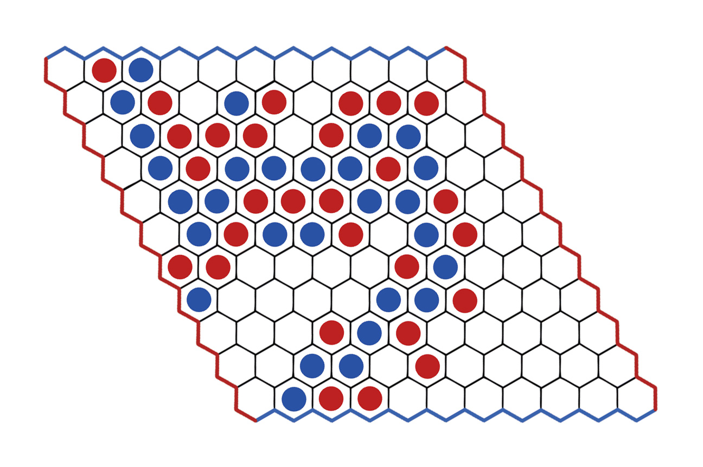

# Bots - Troika 2017

Theme: [Hex - Board Game](https://en.wikipedia.org/wiki/Hex_(board_game))

Read the [Problem Statement](https://goo.gl/uOz2ej)

---
The central code of the project is written in Python3.

The players codes can be written in any one of the following languages.

1. C
2. C++
3. Java
4. Python2
5. Python3

## Setting up the project

### Installing Python3

1. Download and install latest version of Python 3 on your computer. Visit [python.org](https://python.org) for download and installation instructions.
2. Make sure Python3 is correctly installed and is added to the System PATH variables. To check this, open command prompt/terminal, and run command `python` to see if it opens a python shell displaying version of installed python, similar to this:

    ```
    Python 3.5.2 (default, Jul 17 2016, 00:00:00) 
    [GCC 4.8.4] on linux
    Type "help", "copyright", "credits" or "license" for more information.
    >>>
    ```
    
  	**Note: If `python` command opens Python 2 shell on your computer, use `python3` command.**
    
### Cloning/Downloading the project.

Clone this [Github repository](https://github.com/IEEEDTU/Bots17/) or [Download .zip package](https://github.com/IEEEDTU/Bots17/archive/master.zip) of the project.

### Setting up compilers for your language
#### C
1. Download and install latest version of GCC for your computer.
2. Make sure `gcc` command is recognized by your command prompt / terminal.

#### C++
1. Download and install latest version of GCC/G++ for your computer.
2. Make sure `g++` command is recognized by your command prompt / terminal.

#### Java
1. Download and install latest version of JDK for your computer.
2. Make sure `javac` and `java` commands are recognized by your command prompt / terminal.

#### Python2
1. Download and install latest version of Python 2 for your computer.
2. Make sure either `python` or `py` command opens Python 2 shell.

#### Python3
No need to do anything after [Installing Python3](#installing-python3)


## What's in the project

Once downloaded, unzip the compressed folder to see the structure of the project. You'll see folders and files like this:

```
bots17
├── player1/
│   ├── play.c
│   ├── play.cpp
│   ├── Play.java
│   ├── play_py2.py
│   └── play_py3.py
├── player2/
│   ├── play.c
│   ├── play.cpp
│   ├── Play.java
│   ├── play_py2.py
│   └── play_py3.py
├── checker.py
├── disjoint.py
├── main.py
├── p1.py
└── p2.py
```

## How to run the project

Open command prompt / terminal in the root folder of the project(where there is main.py file) or `cd` to that folder.

Run command `python main.py` or `python3 main.py`, whichever corresponds to Python3 shell on your computer. This will execute the project and print language selection menu like this:
```
1. C
2. C++
3. Java
4. Python2
5. Python3
Select language for player 1(1-5): 3
Select language for player 2(1-5): 5
```
Enter your language selections and that's all. The program will **compile** and **execute** the selected language's player codes by itself.
The program will print every move and the winner in the last.

## Coding Instructions

* The player1 and player2 folder contains codes for player1 and player2 respectively.
* There are 5 separate files play.c, play.cpp, Play.java, play_py2.py, play_py3.py containing C, C++, Java, Python2 and Python3 codes respectively.
* The participant must not change folder hierarchy or move/delete/rename any file of the project.
* The participant must only edit the code file inside player1 or player2 folders, only the one corresponding to the language in which he/she wants to code the AI.

---
The Player1 is allocated RED color and the Player2 is allocated BLUE color. Players take turns placing a stone of their color on a single cell within the overall playing board. The goal is to form a connected path of your stones linking the opposing sides of the board marked by your colors, before your opponent connects his or her sides in a similar fashion. The first player to complete his or her connection wins the game. The four corners each belong to both adjacent sides. 

We will play it on an 11x11 grid simulated as rhombus. The top left of the grid is [0, 0] and the bottom right is [10, 10]. The cell **board[i, j]** represent cell in ith row from the top and jth column from the left and it is connected to any of top, left, right, or bottom cell. It is also connected to two of the diagonal cells - **board[i+1, j+1]** and **board[i-1, j-1]**, but not connected with the other two diagonal cells. View example image.



---

### Input
The input will be a 11x11 matrix consisting only of 'U', 'R' or 'B'. Then another line will follow which will contain a character - 'R' or 'B' which is your player id. 

In the given matrix, top-left is [0,0] and bottom-right is [10,10]. The x-coordinate increases from top to bottom, and y-coordinate increases from left to right. 

The cell marked 'U' means it doesn't contain any stones. The cell marked 'R' means it contains player 1 stone which is RED in color. The cell marked 'B' means it contains player 2 stone which is BLUE in color. The player 1 has to connect from left to right (or vice-versa) and player 2 has to connect from top to bottom (or vice-versa) while following the rules.

### Output
Print the coordinates of the cell separated by space, where you want to play your move. You must take care that you don't print invalid coordinates. For example, `1 1` might be a valid coordinate in the game play, but `11 12` will never be. 

Also if you play an invalid move or there is compilation or runtime errors in your code or your code exceeds the time limit while determining the move, you lose the game.

### Pie Rule/Swap Rule
Since the first player to move in Hex has a distinct advantage, the pie rule is implemented for fairness. This rule allows the second player to choose whether to switch positions with the first player after the first player makes the first move.

The second player can return exact coordinates of red stone to swap the stone with blue stone. Care should be taken that this is allowed only one time - after Player1 (Red) has made his first move - and only for the Player2 - player with blue color stones.

For example, if Player1 has already placed its red stone at [4, 5], the player2 can place its blue stone at [4, 5].

### Starting State
Starting state 
The starting state of the game is the state of the board before the game starts. 
```
U U U U U U U U U U U
U U U U U U U U U U U
U U U U U U U U U U U
U U U U U U U U U U U
U U U U U U U U U U U
U U U U U U U U U U U
U U U U U U U U U U U
U U U U U U U U U U U
U U U U U U U U U U U
U U U U U U U U U U U
U U U U U U U U U U U
```

### First Input
First Input 
This is the input give to the first player at the start of the game. 
```
U U U U U U U U U U U
U U U U U U U U U U U
U U U U U U U U U U U
U U U U U U U U U U U
U U U U U U U U U U U
U U U U U U U U U U U
U U U U U U U U U U U
U U U U U U U U U U U
U U U U U U U U U U U
U U U U U U U U U U U
U U U U U U U U U U U
R
```

### Scoring
The scores will be calculated by running a tournament of all submissions at the time of the contest.
The team to win the all the matches will be declared the winner.

### Examples

#### Sample Input
```
R R U U U U U U U U U
U R U B U U U U U U U
U U R U U U U U R U U
U U U U U U B U U U U
U U U B U U U U U U U
U U U U U U R U R U U
U B B U R U U U U U U
U U U U U U B U U U U
U U U U U U U U U U U
U U U U B U U U R U U
U U B U U U U U U U U
B
```
#### Sample Ouput
```
5 2
```
**Explanation**

This is player 2's turn, and the player moves at board[5, 2].

The next state of the board after the move is following:
```
R R U U U U U U U U U
U R U B U U U U U U U
U U R U U U U U R U U
U U U U U U B U U U U
U U U B U U U U U U U
U U B U U U R U R U U
U B B U R U U U U U U
U U U U U U B U U U U
U U U U U U U U U U U
U U U U B U U U R U U
U U B U U U U U U U U
```

You don't need to worry about the next state. This is handled automatically by the program. You just need to take a 11x11 matrix followed by player id as input and then print one valid move. The player id helps you determine which player you are and the matrix helps you determine what's the current state of the board. You have to perform all the logic then and print one valid move.

----
Sample codes to input and output and and an example AI that plays random moves while avoiding invalid moves is provided. Checkout code files inside player1 and player2 folders for the examples.

## Contact Us:

Should you have any queries, please feel free to mail us at

contact@ieeedtu.com or software.ieeedtu@gmail.com, or message us on our Facebook Page

www.facebook.com/ieeedtu. #HappyTroika! :D
